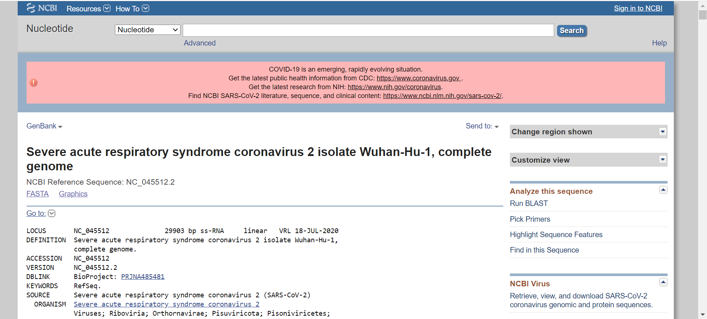
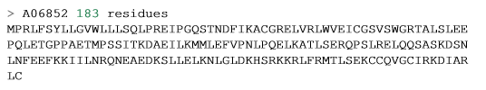
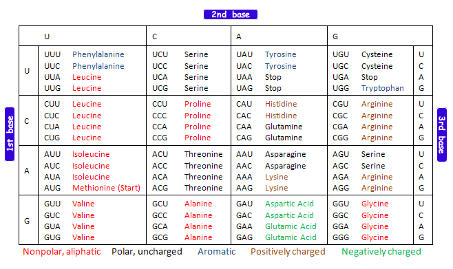
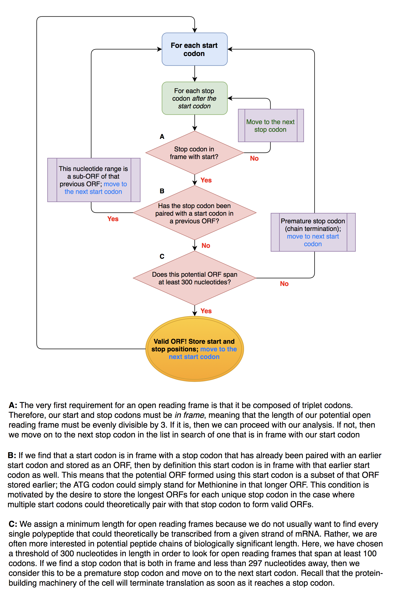
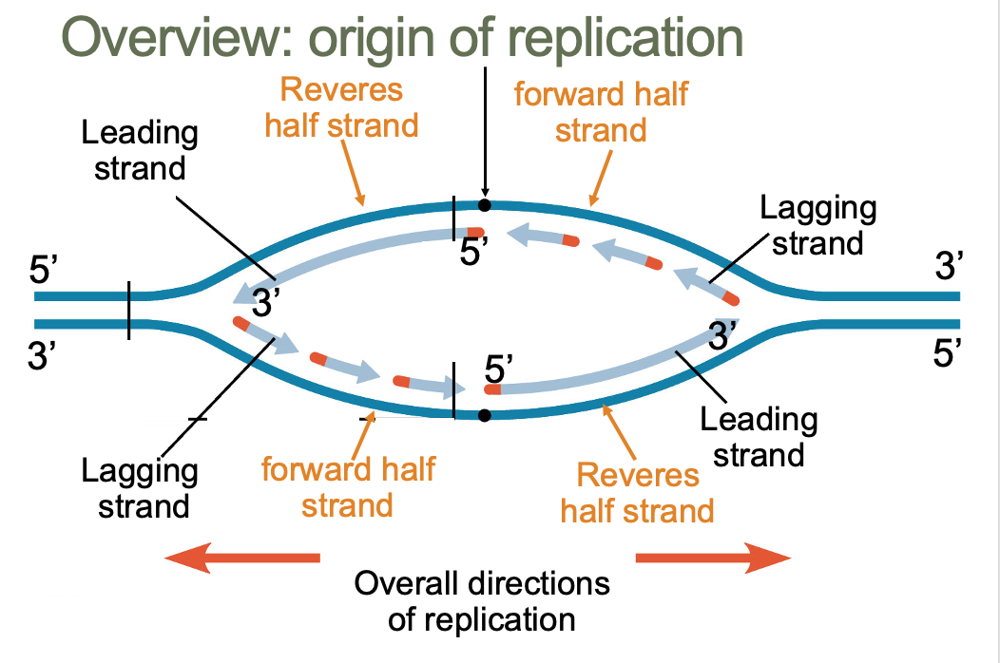

<span style="color:purple">
**Assignment objectives:** <br>
  1. Learn about NCBI sequence databases <br>
  2. Write a function to find Open Reading Frames (ORFs) of a given DNA sequence <br>
  3. Find the origion of replication (*oriC*) of a given DNA molecule <br> 
  \span

<span style="color:red"> For your work in this assignment, please add your answers to the file entitled 'Ans3_LastnameFirstname.Rmd' and change the file name to have *your actual* first and last name. The answers are formatted to be in blue and all questions are in green, in both this document and in the answers document. Upload your answers file as an .Rmd and .html to Canvas by 2:30 p.m. the Friday of next week. \span  

<span style="color:purple"> This week's assignment has been adopted from A Little Book of R for Bioinformatics, written by Avril Coghlan; Dr. Kondrashov's labs from 2015's BIOS 10602; and Bioinformatics Algorithms An Active Learning Approach book, written by Phillip Compeau & Pavel Pevzner. \span  

R can be a powerful tool to carry out analyses common in bioinformatics. Some well known bioinformatics scripts for R are the [Bioconductor](http://www.bioconductor.org) set of R packages that contain several functions for analyzing biological data sets such as microarray data; and the [SeqinR](https://cran.r-project.org/web/packages/seqinr/index.html) package that contain R functions for
obtaining sequences from DNA and protein databases, and for analyzing DNA and protein sequences.  

For this assignment we're going to focus on computational analysis of biological sequence data such as genome sequences. Many authors have written specialized packages for R that don't come with the standard R installation. We need to install and load the SeqinR package before we can use it. Execute the commands:

```{r}
install.packages('seqinr', repos='http://cran.us.r-project.org')

#use either "library("seqinr")" or "require("seqinr")" to load the newly installed package onto R.
```

## Part 1: The NCBI Sequence Database

The National Center for Biotechnology Information (NCBI) maintains a huge database of all the DNA and protein sequence data that has been collected. Each sequence in the NCBI database is stored in a separate record and is assigned a unique identifier called an **accession number** that can be used to refer to that sequence record. You can easily retrieve DNA or protein sequence data from the NCBI Sequence Database via its website: [www.ncbi.nlm.nih.gov](www.ncbi.nlm.nih.gov). The NCBI accession code for severe acute respiratory symdrome coronavirus 2 (SARS-CoV-2) is NC_045512.2. Go to the NCBI website, type "NC_045512.2" in the search box, and press the "Search" button.  


 
There are many databases on the NCBI website. On the results page you will see the number of hits for "NC_045512.2" in each of the NCBI databases on the NCBI website.  **For example, the PubMed database contains abstracts from scientific papers, the Nucleotide database contains DNA and RNA sequence data, the Protein database contains protein sequence data, and so on. We are looking for the RNA genome sequence of SARS-CoV-2, so click on the Nucleotide database.**

When you click on the icon for the NCBI Nucleotide database, it will bring you to the record for NC_045512.2:  



In order to analyze the SARS-CoV-2 genome sequence in R, we need to download the sequence in a **FASTA** format. The FASTA format is a simple format for storing biological (DNA, RNA, and protein) sequences. It begins with a single-line description starting with a ">" character followed by lines of sequences. Here is an example of a FASTA file for a protein sequence:



To access the RNA sequence for SARS-CoV-2 from the Nucleotide database as a FASTA format sequence file, click on the "Send" at the top right of the NC_045512.2 sequence record webpage, choose "File" in the pop-up menu that appears, and then choose FASTA from the "Format" menu. Click "Create file". Name it sarscov2.fasta.
 
##Interface with NCBI in R
One can also carry out searches directly from R using the SeqinR package. The SeqinR package was written by the same group that crated the ACNUC database in Lyon, France. The ACNUC database brings together data from various sources from NCBI, UniProt, and Ensembl, and makes them all very easy to search. For a complete list of all the databases included in the SeqinR package, we can use the `choosebank()` command:

```{r, eval=FALSE}
require("seqinr") #load SeqinR library
choosebank()
```

We just saw all of the databases that we can search with SeqinR. Here are three of the most important ones:  

- "genebank" contains DNA and RNA sequences from the NCBI Sequence Database, except for certain classes of sequences such as draft genome sequence data from genome sequencing projects.  
- "refseq" contains DNA and RNA sequences from the curated part of the NCBI Sequence Database.  
- "refseqViruses" contains DNA, RNA, and protein sequences from viruses from RefSeq.  

If there is a particular database we want to search, we simply name that database in the `choosebank()` function. For example, if we wanted to query the Genbank database, we would say:  	
```{r, eval=FALSE}
choosebank("genbank")
```

After we are finished with all of the analysis for a sequence, if we want to switch to another database to search, first we need to close our current database:	
```{r, eval=FALSE}
closebank()
```

Once we specify which database to search through, we have to tell R what to look for. Luckily, the query() function is flexible, and we can specify a variety of different parameters in our search. For example, if we don't know the accession number, we can provide the name of the organism we're interested in instead. Here is a list of some of the arguments we can supply query():

| Argument | Example | Restricts your search to sequences: |
|----------|---------|-------------------------------------|
|"AC="|"AC=NC_001477"|To the given accession number|
|"SP="|"SP=Chlamydia"|To the specified organism|
|"M="|"M=mRNA"|To a specific type (eg mRNA)|
|"J="|"J=Nature"|Described in a specific journal|
|"R="|"R=Nature/460/352"|Described in a paper in a particular journal, volume, and start page|
|"AU="|"AU=Smith"|Described in a paper or submitted to NCBI by a specified author|

We can combine these arguments with logical operators. Say we wanted to find sequences published in the Nature journal by the author Smith. We would combine the arguments like: "J=Nature AND AU=Smith". Other important operators include OR and NOT. For more information, consult the documentation page for the `query()` function. Say we wanted to find the rabies genome sequence but we didn't know the accession number. Since it's a virus, we would want to search "refseqViruses" database, so we would type the commands:  

```{r, eval=FALSE}
choosebank("refseqViruses")
rabies <- query("SP=Rabies Virus")
```

The results of our search are stored under the list variable rabies. The query function gives us a list with six elements. To see what these objects are named, type:

```{r, eval = FALSE}
attributes(rabies)
```

The content of each of these names is explained in the documentation page of the `query()` function. For example, "nelem" contains the number of sequences that match the query and "req" contains their accession numbers.   
```{r, eval = FALSE}
rabies$nelem[[1]]
```

```{r, eval = FALSE}
rabies$req[[1]]
```

The final step to retrieve a genomic sequence is to use the `getSequence()` function to tell R to retrieve the sequence data. Unlike the `query()` command, we need to know the accession number. To get the sequence of rabies:

```{r, eval=FALSE}
rabies_seq <- getSequence(rabies$req[[1]])
closebank() #closes session
```

<span style="color:green"> 1.1 (a) Search the Genbank database for all human (*Homo sapiens*) tRNA gene sequences. How many sequences match this query? \span

```{r}
library("seqinr") #load SeqinR library
choosebank("refseq")
human <- query("SP=Homo sapiens")
human$nelem[[1]]
```
<span style="color:blue">
179103 sequences match this query.
</span>

<span style="color:green"> (b) Pick any of these matches and save the gene sequence as the variable tRNA_seq. Find the length and GC content of the sequence. \span

```{r}
accNum <- human$req[[1]]
tRNA_seq <- getSequence(human$req[[1]])

length(tRNA_seq)
GC(tRNA_seq)
closebank()
```
<span style="color:blue">
The length and GC content of the sequence is 4945 and 0.486 respectively.
</span>

<span style="color:green"> (c) What is the function of tRNA? (a Google search can help) \span
<br>

<span style="color:blue">
tRNA serves as a link between the mRNA molecule and the growing chain of amino acids that make up a protein
</span>

<span style="color:green"> 1.2 It is important that you know how to find biological data, such as sequences. Doing that, as you saw in assignment, involves accessing a database. But there are many databases with different information, and different databases might handle their entries differently, or be more specialized. What is the difference between NCBI's [Genbank](https://www.ncbi.nlm.nih.gov/genbank/) and [RefSeq](https://www.ncbi.nlm.nih.gov/refseq/)?  \span 
<br>

<span style="color:blue">
RefSeq is limited to major organisms for which sufficient data are available. GenBank includes sequences for any organism submitted.
</span>

Now that you know how to use R to pull genetic data, let's practice making functions to analyze genetic sequences.

## Part 2: Open Reading Frames (ORFs)

#### The Central Dogma of molecular biology
Our genes contain the blueprint for our cells and our bodies. In today's world, this is common knowledge. But what may be less obvious is exactly *how* those sequences of DNA exert their effects in the physical, biological world. The short story is that the plan contained in DNA is put into action by proteins, but this idea brings us to a fundamental teaching in modern biology: **the central dogma of molecular biology**. As originally stated in Francis Crick's (of Watson and Crick fame) 1958 [paper](https://profiles.nlm.nih.gov/spotlight/sc/feature/doublehelix) "On Protein Synthesis", the central dogma *"...states that once 'information' has passed into protein it cannot get out again. In more detail, the transfer of information from nucleic acid to nucleic acid, or from nucleic acid to protein may be possible, but transfer from protein to protein, or from protein to nucleic acid is impossible. Information means here the precise determination of sequence, either of bases in the nucleic acid or of amino acid residues in the protein."*

A consequence of this statement--with the benefit of some additional information from experimental biology since 1958--is the following: **The flow of information during protein synthesis is *from DNA to RNA to Protein***. We've touched upon DNA and proteins, but what is this RNA intermediary? The first step on the path from DNA to protein is for the double-stranded DNA to be **transcribed** to form a single-stranded mRNA (messenger RNA) molecule. A big benefit of this transcription step is that *many mRNA molecules can be repeatedly transcribed from DNA*, allowing for **amplification**. 

To illustrate the benefits of amplification, imagine if every high schooler in the United States had to be taught biology from a *single physical copy* of a textbook. Learning anything would be practically impossible! Similarly, if proteins were created directly from DNA, then the resulting traffic jam in the nuclei of our cells would make cellular processes slow to a crawl. Instead, by first transcribing to an mRNA intermediary, cells are able to quickly manufacture key proteins in large quantities. We are able to make photocopies of that precious, precious textbook. 

However, we encounter a slight problem, because there are four nucleic acids used in our genetic code (ATCG for DNA, AUCG for RNA), but there are 20 (sometimes more!) amino acids used in the construction of our proteins. A one-to-one translation would be clearly impossible. Instead, to translate from mRNA to protein, **three nucleotides code for one amino acid**. Strings of these **triplet codons** form the **protein-coding regions** of our genes. A table of codons follows:


<br>

So there is the mRNA code to protein code translation problem solved. But how do we know where the protein-coding regions begin? Another problem. There are many different markers that tell us where protein-coding regions reside in our genomes, but a basic and important one that helps us to predict the locations is the concept of the **open reading frame** or **ORF**, a string of nucleotides that starts with a **start (AUG)** codon and ends with a **stop (TAA, or TAG, or TGA)** codon. We will be implementing an algorithm to find all ORFs with some minimum length in a given nucleotide sequence below. In support of this endeavor, we will write a few helper functions now.

<span style="color:blue">
Here is a helper function that I wrote in HW2, that I will use a couple times in the following parts.
</span>
```{r}
# given a DNA sequence, output the complementary strand
compStrand <- function(seq){
  map=c("a"="t", "t"="a","g"="c","c"="g")
  compl <- seq
  for(i in 1:length(compl)){
    compl[i] <- as.character(map[seq[i]])
  }
  return(rev(compl))
}
```


<span style="color:green"> 2.1 a) Write a function that takes in a gene sequence and stores the indices of the first nucleotide of the start codon in the vector `startcodons`, and returns this vector at the end. Note that the DNA sequences we will use will contain lower case characters, i.e. "a", "t", "g", "c". The last 2 lines in the chunk will test your `findStartCodons()` function on a sample sequence called `seq`. Pseudocode is given below to help guide you, but you are free to write in your own style. *Hint: use a nested if statement inside a for loop to iterate over the entire sequence and evaluate whether the letters are "a", "t", "g" using truth statements (`&&` and `==`). USE LOWERCASE LETTERS* \span


```{r}
findStartCodons <- function(seq){
  startcodons <- numeric(0) #This will initiate an empty vector. You can index into this vector at any location to store a new value. I.e. to store a value of 100 in the first position of this vector, you would index into the first location in `startcodons` and set it equal to 100.
  k <- 1 #use k to index the 'startcodons' vector (startcodons[k]) as you store in it the index of each start codon you find in 'seq'. Remember to increase k each time (k<-k+1). 
  for(i in 1:(length(seq)-5)){
    if(seq[i] == "a" && seq[i+1] == "t" && seq[i+2] == "g") {
      startcodons[k] <- i
      k <- k + 1
    }
  }
  return(startcodons)
}

#Testing the function
seq<-c("g", "t", "a", "a", "t", "g", "t", "a", "g", "t", "g", "a", "t", "t", "g", "t", "a", "g")
findStartCodons(seq)

```

<span style="color:green"> In 2.1(b), The for loop iterated over `1:(length(seq)-5)`,whereas in 2.1(c), it will iterate over `1:(length(seq)-2)`.. Explain the logic behind this difference. (Hint: to understand `1:(length(seq)-5)` in 1c, think about where the start and stop codons must fall in order for them to create an open reading frame.) \span

<span style="color:blue">
There cannot be a start codon as the last codon in the DNA sequence. So we don't need to search the last codon, as there is no chance for it to be a start. However, the last codon may be a stop codon. 
</span>

<span style="color:green">2.1 c) Write a function that takes in a gene sequence and stores the indices of the first nucleotide of stop codons in the vector `stopcodons`, and return this vector at the end. Pseudocode is given below to help guide you, but you are free to write in your own style. Remember that there are three different stop codons! *Hint: some ways of doing this include using the OR statement (`||`), or multiple if statements.*\span

```{r}
# This function receives a DNA sequence as input and outputs a vector with the position of all stop codons.

findStopCodons <- function(seq){
  stopcodons <-numeric(0)#This will initiate an empty vector. You can index into this vector at any location to store a new value. For example, to store a value of 100 in the first position of this vector, you would index into the first location in stopcodons and set it equal to 100.
  k <- 1
  for(i in 1:(length(seq)-2)){ 
    # check for TAA
    if(seq[i] == "t" && seq[i+1] == "a" && seq[i+2] == "a") {
      stopcodons[k] <- i
      k <- k + 1
    }
    
    # check for TAG
    if(seq[i] == "t" && seq[i+1] == "a" && seq[i+2] == "g") {
      stopcodons[k] <- i
      k <- k + 1
    }
    
    # check for TGA
    if(seq[i] == "t" && seq[i+1] == "g" && seq[i+2] == "a") {
      stopcodons[k] <- i
      k <- k + 1
    }
  }
  return(stopcodons)
}
#Testing the function
seq<-c("g", "t", "a", "a", "t", "g", "t", "a", "g", "t", "g", "a", "t", "t", "g", "t", "a", "g")
findStopCodons(seq)
```

A large number of protein sequences start with Methionine. From the the table above, we can see that the codon for Methionine is AUG (ATG in DNA code), and is also labeled as "Start". But Methionine is also an important amino acid *within* protein structures. How do we then determine where a protein begins? The truth is that, based on the genetic code alone, this is a difficult task. But we can predict where protein-coding regions begin and end because all protein sequences also end in one of three codons: UAA, UAG, or UGA (TAA, TAG, and TGA in DNA code). These are the **stop codons**. They do not normally code for amino acids but rather serve to signify that translation of the protein will terminate at that position. ***If a stop codon is encountered by protein-forming machinery, then translation *will stop**.

<span style="color:blue">
So a structure for an open reading frame begins to appear: a start codon, some number of intervening codons that code for the amino acids of the protein, and a stop codon to terminate the sequence. All of these components are formed from three-nucleotide codons, so a key property of these frames is that **their length in nucleotides is evenly divisible by 3**.\span

**But there is another problem. There are three different "frames" possible for a given direction. To explain:**
Consider the sequence "GTCATGAT". If we start from the first nucleotide "G" and start assigning codons, then we get the following: **(frame 1) GTC ATG, or Valine Methionine**. Let's start at the second nucleotide: **(frame 2) TCA TGA, or Serine STOP**. And if we start at nucleotide 3: **(frame 3) CAT GAT, or Histidine Aspartate**. Note that if we start at the fourth nucleotide, we are ***in reading frame 1 once again***: ATG. All of this also applies to the complementary strand, so for a double-stranded genome, there are six possible reading frames.

From this, we can see that if we want our open readng frames to begin with our start codon (ATG) and end with one of our stop codons (TAA, TAG, or TGA), then we will need our start and stop codons to be **in the same reading frame**. Put simply, this means that the length spanned by our open reading frame (first nucleotide of start codon to final nucleotide of our stop codon) must be evenly divisible by 3.

Now we're getting somewhere. Another condition is the ability to store the longest ORFs for each unique stop codon in the case where multiple start codons could theoretically pair with that stop codon to form valid ORFs. A final condition is that our ORFs **must be of some minimum length with no intervening in-frame stop codons.** This means that our ORFs must code for a certain number of amino acids so that the product will be a polypeptide of significant length. If there is a stop codon in-frame between our chosen start and stop codons, then that ORF would terminate by definition at that intervening stop codon, so our putative ORF is not valid.

To summarize, our general strategy is delineated below:

1) Determine the index for all the start codons for a given reading frame
2) Determine the index for all the stop codons for a given reading frame 
3) For each start codon, find the nearest stop codon (that comes after the start codon). If the stop codon fulfills all requirements (in-frame, over the minimum length), store as ORF. 
4) Start at the next start codon AFTER the last stop codon. 
5) Repeat for all reading frames 



<span style="color:green"> 2.2 Write a function to find possible open reading frames (ORFs) in a given sequence. Let us define those to be a substring starting with the start codon "AUG" and ending with one of the stop codons and whose length is divisible by 3 so it can be a coding sequence without any intervening in-frame stop codons. Also, store the longest ORFs for each unique stop codon in the case where multiple start codons could theoretically pair with that stop codon to form valid ORFs. The inputs should be a nucleotide sequence and a minimum length in codons, and the output should be a character vector containing strings of the following format (see `?paste`): `"<first base of start> to <last base of stop>"` (i.e. `"409 to 1273"`). A pseudocode sketch of a possible code implementation is below: \span

```{r}

findORF <- function(sequence, minLength) {
    ORFs <- character()
    startInds <- findStartCodons(sequence)
    stopInds <- findStopCodons(sequence)
    # loop through each reading frame
    for(i in 1:3) {
        indexStart <- i
        while (indexStart < (length(sequence)-minLength*3+1)) {
            if(indexStart %in% startInds) {
                numCodons <- 2 #for the start codon and the first codon considered in the following iteration
                firstPossStop <- indexStart + 3*numCodons
                for(indexStop in seq(firstPossStop,length(sequence),by=3)) {
                    if(indexStop %in% stopInds) {
                        if(numCodons >= minLength) {
                            currORF <- paste(indexStart, "to", indexStop+2, sep=" ")
                            ORFs <- append(ORFs, currORF)
                        }
                        indexStart <- indexStop
                        break
                    }
                    numCodons <- numCodons + 1
                }
            }
            indexStart <- indexStart + 3
        }
    }
    return(ORFs)
}
```

`break` statements are used inside a loop to basically break out of it. It does not return a value; it stops the iterations and transfers the control of the loop to outside of the loop. In a nested loop, the statement exits from the inner-most loop to the first statement outside. 


<span style="color:green">2.3. Use the function you wrote above to calculate the possible ORFs with a minimum length of 200 (triplet, 600 nucleotides) codons in the Zika virus genome. Please **display your results**. Note: You will need to **load the genome** (stored in 'Zika.fasta') into R using `read.fasta()` from `library(seqinr)`. \span
```{r}
# load the zika virus sequence
library("seqinr")
zika <- read.fasta(file = "Sequences/zika.fasta")
zika_seq <- zika[[1]]

# find open reading frames (DNA and complementary sequence)
findORF(zika_seq, 200)
findORF(compStrand(zika_seq), 200)
```


<span style="color:green">2.4. Do you find the number of ORFs surprising **considering the number of proteins coded by the virus**? Do some research into how the zika genome is organized and expressed (you may find [this page](http://viralzone.expasy.org/6756?outline=all_by_species) useful). With this information in mind, justify the number of ORFs you found in question 2.3. (Note: pay attention to the biological mechanism of the genome expression.) \span

<span style="color:blue">
Yes, I find it surprising that there is only one ORF in the genome considering the number of proteins coded for by the virus. The whole genome is translated into one large protein, which is then processed co- and post-translationally by host and viral proteases.
</span>

<span style="color:green">2.5 Use the function you wrote above to calculate the possible ORFs (minimum length of 100, that is, 300 nucleotides) in the coronavirus genome. Note: You will need to **load the genome** (stored in 'covid19.fasta') into R using `read.fasta()` from `library(seqinr)`. \span

```{r}
# load the covid19 virus sequence
library("seqinr")
covid19 <- read.fasta(file = "Sequences/covid19.fasta")
covid19_seq <- covid19[[1]]

# open reading frames in both DNA seq and comp strand
findORF(covid19_seq, 100)
findORF(compStrand(covid19_seq), 100)
```


<span style="color:green">2.6 Do you find the number of ORFs surprising in in the coronavirus genome **considering the number of proteins coded by the virus**? Do some research into how the coronavirus genome is organized and expressed (you may find [this page](https://www-ncbi-nlm-nih-gov.proxy.uchicago.edu/pmc/articles/PMC7525243/) useful). With this information in mind, justify the number of ORFs you found in question 2.5. \span
<br>

<span style="color:blue">
Yes, I find the low number of ORFs surprising considering the number of proteins coded by the virus is relatively large. According to our lecture, this is because the nonstructural proteins get expressed as two long polypeptides, which then get chopped up by the virus's main protease.
</span>

<span style="color:green">2.7 Use the function you wrote above to calculate the possible ORFs (minimum length 50, that is, 150 nucleotides) in the HIV virus genome. Note: You will need to load the genome (stored in 'HIV.fasta') into R using `read.fasta()` from `library(seqinr)`. Compare the number of ORFs you find to the number of genes known to be encoded by the HIV genome. Propose a reason for how there are more proteins produced by HIV than the number of its genes.\span
```{r}
# load the HIV sequence
library("seqinr")
hiv <- read.fasta(file = "Sequences/HIV.fasta")
hiv_seq <- hiv[[1]]

# open reading frames in both DNA seq and comp strand
findORF(hiv_seq, 50)
findORF(compStrand(hiv_seq), 50)
```
<span style="color:blue">
One reason that there are more proteins produced by HIV than the number of its genes is because of alternative RNA splicing. This is the process of selecting different exons to actually be spliced together to the final mRNA that gets translated into the protein. This can allow for a single gene to code for multiple different proteins depending on the combination of exons spliced together.
</span>

## Part 3: Finding *oriC*

The next question tries to use the tools you have learned and developed to try to address the question: Where is the origin of DNA replication?

<span style="color:blue"> Watch the DNA replication video in the lab folder. \span

We will try to do this in the bacterial genome, which usually has only one chromosome. The bacterial genome, different from that of animals, plants, fungi and archaea, is usually circular. This slightly complicates its analysis, since there isn't a point where it starts or ends, and it isn't easy to handle circular data. Hence, we are going to handle bacterial genomes as DNA sequences, as if the circular genome had been cut at an arbitrary point. Replication is fundamental for the maintenance of life, and hence, finding the point where it starts in the genome might be key to understanding certain life processes. DNA replication is performed by enzymes called DNA polymerases. They do this by first binding to specific regions of DNA, then splitting the two strands of DNA and finally creating new strands, one for each of the original strands. This way, DNA replication is semi-conservative. Our question is then, where does replication start? We will call the region where replication starts as **oriC**. There are ways of finding *oriC* experimentally, but these methods are much slower. If we can find, using computational methods, a way of suggesting some regions where *oriC* could be, even though not giving the exact region, we might help a lot in speeding up these experimental approaches.  

 

One approach to finding *oriC* would be to try to find some words in the bacterial genome that indicate that region as where replication starts. This could be done statistically, by finding unusually frequent words (in the sense that it is more frequent in the DNA genome than in a randomly generated sequence of the letters "A", "G", "C" and "T" of the same length) clumping together within short regions of the genome. We are going to instead use an approach based on the content of guanine and the content of cytosine in the genome, by using a sliding window approach.  

But why should the frequencies of G and C help settle this question? This was hinted at in the lab. It turns out that replication generates mutational anomalies due to the asymmetry of replication. This is because DNA polymerase is *unidirectional*, it can only transverse DNA in the reverse direction (from 3' to 5'). This causes no problem for the reverse half-strand, but the forward half-strand, which is unraveled for replication from 5' to 3', can't be replicated from the start; it must wait until there is enough space for the DNA polymerase (these enzymes are huge biological machines, and need a fair amount of space before binding) to bind a few nucleotides down the road and then be able to replicate the short segment that was unraveled thus far in the direction 3'-> 5'.
These generates several phenomena in DNA, such as the famous Okazaki fragments. What is relevant to us though, is that, because of this, the forward half-strand spends much more time single stranded than the reverse half-strand. And single-stranded DNA has much higher mutation rates than double-stranded DNA! <span style="color:red"> **Specifically, C tends to mutate into T by a process called deamination** \span. 

The rate of deamination in single-stranded DNA is 100 times higher than in double-stranded DNA. This creates mismatched pairs T-G which are then corrected in the next replication into T-A pairs. It should be the case then, that in the forward half-strand the C content should be low in relation to the G content, and the opposite behavior in the reverse half-strand (because the forward half-strand of the complementary strand pairs with the reverse half-strand of the original strand). In particular, `G_content(genome)-C_content(genome)`, for some genome, should be smallest close to the *oriC*, since *oriC* is the point that separates the beginning of the reverse half-strand and the end of the forward half-strand. 

<span style="color:green"> 3.1 With all of this said, let's analyze the most studied bacterial genome: *E. Coli*. \span

Put the *E. coli*, *Thermotoga petrophila* and *Sulfolobus solfataricus* in your working directory. The following code loads all of these files into R.

```{r}
e_coli <- read.fasta("Sequences/E. coli.fasta")[[1]]
t_petrophila <- read.fasta("Sequences/Thermotoga petrophila.fasta")[[1]]
s_solfataricus <- read.fasta("Sequences/Sulfolobus solfataricus.fasta")[[1]]
```

<span style="color:green"> (b) What we will do is try to find the point where the difference between the G content and the C content achieves a minimum. For that, write a function called `skew()` that receives as input a vector of characters aka a DNA sequence (which in our case will be in fact a whole bacterial genome) and a positive integer i and outputs the difference between the G count and the C count from the first nucleotide in the DNA sequence up to nucleotide number i (for i = 0, define the skew to be 0).  \span

```{r}
skew <- function(seq, i){
  skewVec <- numeric(i)
  GC_diff_sofar <- 0
  
  for(ind in 1:i){
    if (seq[ind] == "g"){
      skewVec[ind] <- GC_diff_sofar + 1 
    }
    else if (seq[ind] == "c"){
      skewVec[ind] <- GC_diff_sofar - 1 
    }
    else {
      skewVec[ind] <- GC_diff_sofar
    }
    GC_diff_sofar <- skewVec[ind]
  }
  
  return(skewVec)
}

exDNA<- c("c","t","a","t","g","g","c","g","g","g","t","a")
skew(exDNA, 8)
```


<span style="color:green"> (c) Now, write a function called `skewDiagram()` that, given a DNA sequence, outputs the skew diagram of the DNA sequence. A skew diagram is a plot that has on the x axis positive integers (with x ranging from 0 to the length of the DNA sequence), and on the y axis the skew of the DNA sequence up to the index x. Hint: This is the first time in this course you are going to face genomical analysis. One of its challenges is that genomes are huge. Even a bacterial genome might be non-trivial to a personal computer. Therefore, your implementation of the algorithm might affect a lot the time you spend in this assignment. Think carefully on how to implement your function. First of all, do not recount G and C every time you need to compute some skew. Instead, find a way of just updating previous skews. (**NOTE: to make this execute in << tens of minutes, plot `skew[seq(1, length(skew), 10000)]` vs. `seq(1, length(skew), 10000)`) Be sure to ask to your TA for help if needed. Below is some pseudocode to get you started. Note that the code is for both part b and c.\span 

```{r}

#PART C
#second function to plot our skew vector
#be sure to plot ONLY EVERY 10,000TH VALUE IN YOUR SKEW VECTOR 
  #hint: use seq()
skewdiagram <- function(seq){
  skew <- skew(seq, length(seq))
  plot(seq(1, length(skew), 10000), skew[seq(1, length(skew), 10000)], xlab="Nucleotide Position", ylab="GC Skew", main="GC Skew vs. Nucleotide Position")
}
```


<span style="color:green"> (d) Write a function `min_skew` that, given a DNA sequence, finds the i such that `skew(DNA, i)` is the minimum among possible i. \span  
```{r}
min_skew <- function(seq){
  skew <- skew(seq, length(seq))
  return(which.min(skew))
}
```


<span style="color:green"> (e) Now, use the functions you just wrote to analyze the genome of *E. coli*. Given the skew diagram of *E. coli*, report **and justify** where you expect *oriC* to be located in the *E. coli* genome (notice that the minimum may differ from *oriC* due to random fluctuations in the G or C frequencies, hence, you should really indicate a short region rather than a point). (Hint: your suggested region should be a span 500 to 1000 nucleotides long) \span 
```{r}
skewdiagram(e_coli)
```
```{r}
min_skew(e_coli)
```
<span style="color:blue">
I expect the oriC to be around the 3,925,000 - 3,926,000 base. This is around the minimum point of the GC skew. GC skew should be minimized at the Ori because deamination of the complementary strand reduces G content left of the Ori and the G content should be higher on the right side.
</span>

<span style="color:green"> 3.2 Now, load the genome of *Thermotoga petrophila* and plot its skew diagram. How is this different from that of *E. coli*? Where would you expect the *oriC* of *Thermotoga petrophila* to be? \span
```{r}
skewdiagram(t_petrophila)
```
```{r}
min_skew(t_petrophila)
```


<span style="color:blue">
This is different from the skew diagram of E. coli in that it has multiple local minima rather than in the E. coli genome where there was one clear minimum. I would expect the oriC to be at the global minimum of the GC skew which is around the 787,000-788,000 base.
</span>

<span style="color:green"> 3.3 Load the genome of the archea *Sulfolobus solfataricus* and plot its skew diagram. We've seen that the minimum skew provides a guess for the *oriC* of bacterial genome. Notice though, that we were focusing on global minima. You can see on the skew diagram of *Sulfolobus solfataricus* that there are three clear valleys were you can identify local minima. What might this indicate? Try to find published experimental evidence that proves your hypothesis. \span
```{r}
skewdiagram(s_solfataricus)
```

```{r}
min_skew(s_solfataricus)
```

<span style="color:blue">
The presence of multiple local minima could indicate that there are multiple origins of replication. This theory seems to be supported by [this article](https://www-ncbi-nlm-nih-gov.proxy.uchicago.edu/pmc/articles/PMC7525243/)
</span>